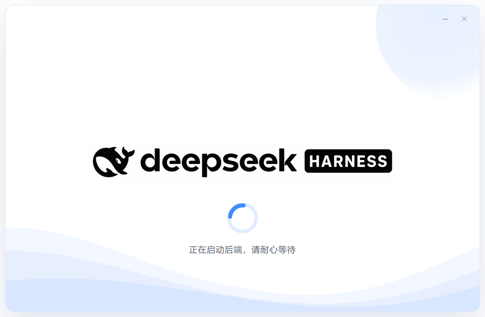

<div align="center">


# DSH-DesktopX

**把本机已经装好的 `dsh` 装进一个真正的桌面窗口。**

双击图标 → 启动动画 → 进入 `dsh web`。不打包后端，不修改上游，不做多余的事。

[](https://github.com/tkhs101/DSH-DesktopX/releases)
[](#-安装)
[](src)
[](#-为什么不选-dsh-desktop)
[](https://github.com/deepseek-ai/deepseek-harness)



<sub>启动动画：官方 LOGO + 蓝色圆环，后端就绪即刻进窗，无倒计时</sub>

</div>

---

## 它是什么

DSH-DesktopX 是一个 **Windows 桌面套壳**。它只做四件事：

1. 双击图标，弹出启动动画；
2. 用 `dsh web --no-open --port 0` 拉起**你本机已安装的** DeepSeek Harness 后端；
3. 从 stdout 抓出那行带 token 的 `http://127.0.0.1:<port>/?token=...`；
4. 把它装进一个独立窗口。关窗缩托盘，后端继续跑。

**后端就是你自己的 `dsh`**——你 `npm i -g` 升级到哪个版本，壳就跑哪个版本。壳不复制、不打包、不固定上游版本。

> 上游项目：[deepseek-ai/deepseek-harness](https://github.com/deepseek-ai/deepseek-harness)（本机已验证 `dsh 0.1.5-rc.1`）

## 特性

| | |
|---|---|
| 🖳 **独立窗口** | 不再是一堆浏览器标签页，有自己的任务栏图标和窗口 |
| 🎬 **启动动画** | 官方 LOGO + 圆环 loading，白卡片 + 浅蓝波浪，非黑底粗糙转圈 |
| 🙂 **不挡视线** | 启动动画**不置顶**，可拖动，右上角自带最小化 `─` / 关闭 `✕` |
| ⚡ **无倒计时** | 后端一就绪就进窗，动画不会拖时间（冷启动的等待来自 `dsh` 本身） |
| 🔔 **重启有提示** | 托盘点重启，右下角弹卡片「正在重启后端…请等待自动刷新」，带圆环 loading，就绪后自动消失 |
| 📌 **托盘常驻** | 点 X 缩到托盘，后端继续跑；点托盘图标秒开 |
| 🔒 **零外部网络** | 源码里没有任何 `fetch`/`http` 调用，只连 `127.0.0.1` |
| 📖 **可审计** | 全部逻辑 5 个文件、约 301 行 TypeScript，几分钟读完 |
| 🧯 **失败不白屏** | 找不到 `dsh` 时弹中文错误页，直接告诉你装什么 |

## 安装

### 1. 先装依赖（必须）

```powershell
# Node.js 22.19+ 或 24+
node --version

# 全局安装 DeepSeek Harness
npm i -g @deepseek-ai/dsh
dsh --version
```

### 2. 再装壳

到 [Releases](https://github.com/tkhs101/DSH-DesktopX/releases) 下载 `DSH-DesktopX Setup x.y.z.exe`，双击安装。

> ⚠️ **SmartScreen 蓝框是预期的**：本项目未签名（个人项目，不打算买证书）。点「更多信息」→「仍要运行」即可。这是所有新发布软件的正常流程。

- per-user 安装，**不需要管理员权限**
- 目录页显示裸路径（如 `C:\RUANJIAN`）时，安装时会**自动**进 `C:\RUANJIAN\DSH-DesktopX\` 子目录
- 聊天记录/设置存在本机 `$DSH_HOME`，重装壳不受影响

### 3. 用法

| 操作 | 结果 |
|---|---|
| 双击桌面图标 | 启动动画 → 进 WebUI |
| 点窗口 X | 缩到托盘，**后端继续运行** |
| 点托盘图标 | 立刻把窗口拉回来 |
| 右键托盘 → 重启后端 | 重跑一次 `dsh web`，右下角弹提示卡片，就绪后自动刷新 |
| 右键托盘 → 彻底退出 | 停掉后端并退出（含子进程树） |
| 启动动画上的 `─` / `✕` | 最小化到任务栏 / 取消启动并退出 |

## 为什么不选 dsh-desktop

社区里最主流的选择是 [anywhere-labs/dsh-desktop](https://github.com/anywhere-labs/dsh-desktop)（27k stars，MIT）。**它功能更全，本项目不是它的替代品**——定位不同

| 对比项 | **DSH-DesktopX**（本项目） | [anywhere-labs/dsh-desktop](https://github.com/anywhere-labs/dsh-desktop) |
|---|:---:|:---:|
| 后端版本跟进 | ✅ **跑你本机 `dsh`**，`npm i -g` 升级即刻生效 | ❌ 固定内置 `deepseek-harness @ 0a15e36`，升级要等它发版 |
| 上游 bug 修复到手速度 | ✅ 上游一发版你就能用 | ❌ 等同步 + 等发版 |
| 安装包体积 | ✅ **89.7 MB** | ❌ 156 MB（x64）/ 319 MB（dmg），**多 1.7～3.5 倍** |
| 源码可审计性 | ✅ **301 行 TS / 5 个文件**，几分钟读完 | ❌ 13,275 commits + 子模块 + Yarn workspace + 插件 fabric |
| 外部网络请求 | ✅ **零**：源码无任何 `fetch`/`http` 调用 | ❌ 自动更新带 `X-DSH-Desktop-Version`、`Channel`、`Installation-Id`（随机 UUID）请求头 |
| 默认功能面（攻击面） | ✅ 只有「开窗 + 托盘」两件事 | ❌ 插件市场 + 手机远程 + 终端 + 局域网访问 |
| 局域网暴露风险 | ✅ **无此功能**，不存在误开风险 | ❌ 提供局域网开关；其文档自述「向局域网开放不提供鉴权」 |
| 供应链复杂度 | ✅ 只依赖你**已经装好的** `dsh` | ❌ 内置整套上游 + 插件市场数据源 + 市场 adapter |
| 更新控制权 | ✅ 你自己决定何时升级 | ❌ 应用内自动更新，你被动跟随 |
| 出问题能自己修 | ✅ 改一行正则就行（`src/main/backend.ts`） | ❌ 需要跟随 27k star 项目的维护节奏 |
| 启动动画挡不挡事 | ✅ 不置顶、可拖动、自带 `─`/`✕` | — |
| 失败提示 | ✅ 中文错误页，直接告诉你要装什么 | — |

### 一句话总结

| | |
|---|---|
| **dsh-desktop** | 你**不装 Node.js** 也能用 —— 代价是 156 MB、锁定版本、默认联网检查更新、以及一整套你用不上的功能面 |
| **DSH-DesktopX** | 你**已经装了 `dsh`** —— 那么这 301 行就是最省事的那层窗户纸 |

**5 个选我们的理由：**

1. **版本永远最新** — 上游还在 developer preview、迭代很快，锁版本意味着你永远慢一拍。
2. **不重复造轮子** — 你机器上本来就有 `dsh`，没必要再塞一份运行时 + 一份后端。
3. **零出网** — 301 行里没有任何外部请求，只有 `127.0.0.1`。
4. **没有多余攻击面** — 不做市场、不做远程、不做局域网，就没有对应的风险。
5. **坏了自己能修** — 5 个文件读一遍，改一行正则就适配上游变更。

<details>
<summary><sub>什么时候该选 dsh-desktop（点开）</sub></summary>

- 你不想装 Node.js，想下载就双击用 —— 这是它的核心优势
- 你用 macOS —— 目前只有它支持
- 你要插件市场 / 手机远程控制 / 自动更新 / 内置终端 —— 本项目明确不做
- 你需要团队统一、固定可复现的上游版本
- 你更看重 27k stars 的社区与长期维护

本项目适合：**已经装了 `dsh`、想要一个干净窗口、并且希望它尽可能小、尽可能透明、尽可能不碍事**的人。

</details>

## 开发

```sh
npm install
npm run dev     # 构建 + 启动 Electron（会真实 spawn 本机 dsh）
npm run smoke   # 启动探针：真实起后端，180s 内抓到就绪行则 pass
npm run pack    # 打 NSIS 安装包（unsigned），产物在 release/
```

### 源码地图

| 文件 | 行数 | 职责 |
|---|---|---|
| `src/main/backend.ts` | 85 | spawn `dsh web`、解析就绪行、超时/退出处理、优雅停服 |
| `src/main/index.ts` | 102 | 应用启动、单实例锁、IPC、重启提示、错误页兜底 |
| `src/main/windows.ts` | 78 | 主窗口 + 启动窗口 + 提示卡片创建、外链拦截、标题锁定 |
| `src/main/tray.ts` | 25 | 托盘菜单 |
| `src/preload/preload.ts` | 11 | `hideWindow` / `minimizeSplash` / `closeSplash` / `appVersion` |
| `assets/splash.html` | — | 启动动画（纯 HTML/CSS/SVG，无框架无依赖） |
| `assets/toast.html` | — | 重启提示卡片（与启动页同一套视觉） |

### 上游兼容性

就绪行契约：stdout 出现 `dsh web: http://127.0.0.1:<port>/?token=<token>` 即视为就绪。

- 已验证：`dsh 0.1.5-rc.1`
- 上游若改了这行格式，只需改 `src/main/backend.ts` 里的 `WEB_READY_RE`。

## 非目标

自动更新、插件市场、手机远程、局域网共享、内置终端、多后端、记住关窗选择——**都不做**。

## 声明

本项目是**独立的社区套壳**，与深度求索（DeepSeek）不存在隶属、合作、授权或背书关系。「DeepSeek Harness」是深度求索公司的注册商标，此处仅用于说明兼容性与技术来源。核心智能体能力、Web UI、插件系统均来自[上游项目](https://github.com/deepseek-ai/deepseek-harness)。

## License

MIT
